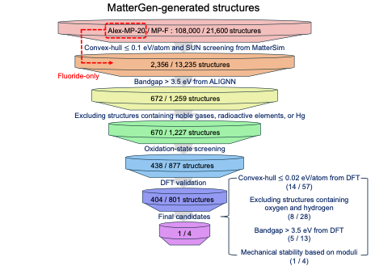

# First-Principles Screening of Fluoride-Ion Battery Materials

This repository contains crystal structures generated and screened for the discovery of candidate materials for fluoride-ion batteries (FIBs).

## Screening Workflow



Candidate structures were generated using MatterGen and subsequently screened through multiple stages based on composition, predicted electronic properties, chemical criteria, oxidation states, and DFT calculations.

## Repository Structure

```text
.
├── alex-mp-20/
│   ├── RED/
│   ├── ORANGE/
│   ├── YELLOW/
│   ├── GREEN/
│   ├── BLUE/
│   └── NAVY/
│
├── structures/
│   └── final_candidate/
│
├── figures/
│   └── screening_workflow.png
│
├── README.md
└── LICENSE
